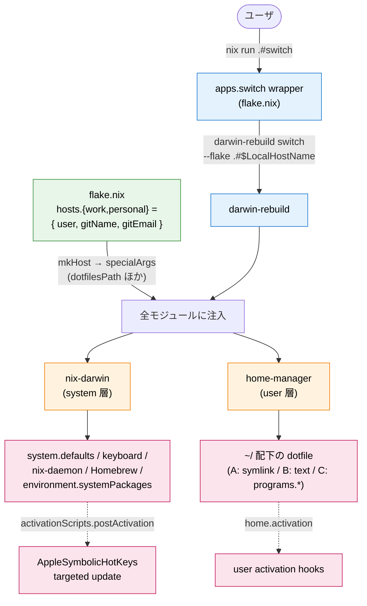
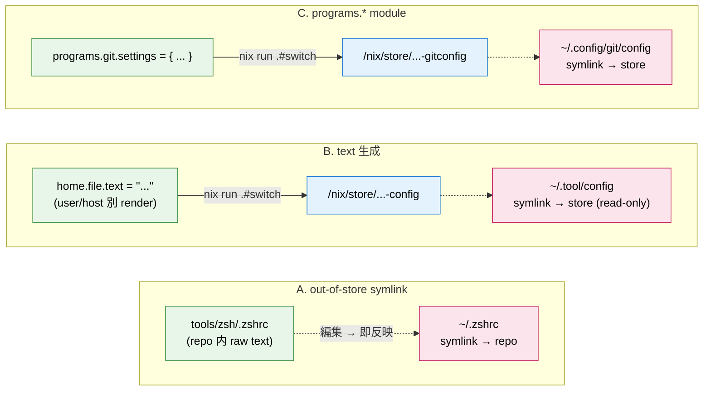
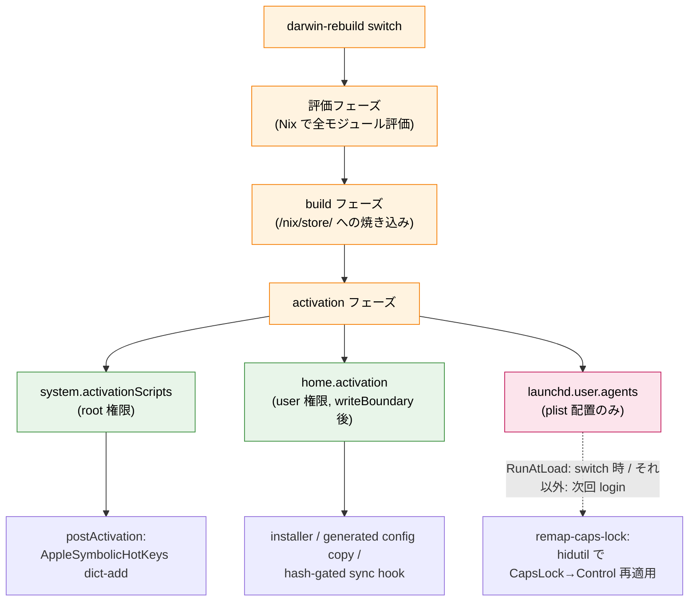

# 設計思想: nix-darwin + home-manager 一本化

[English](design-philosophy.md) | 日本語

このリポジトリは **nix-darwin + home-manager の二段構成**で運用している。
`~/` 配下の設定ファイルもすべて home-manager で declarative に配置するのが
現状の方針。

## TL;DR

新しい設定を追加するとき、置き場所の判断は **「raw text symlink で済むか、
それとも `programs.*` を使う動機があるか」** で切る。default は out-of-store
symlink で、以下のいずれかに当てはまるときだけ `programs.*` を選ぶ:

* **Nix で評価した値を設定内容に注入したい** — `specialArgs` 経由で host /
  user 別に流れてくる値を config 本文に埋めたい場合 (例: `programs.git` で
  `settings.user.name = gitName;` を specialArgs から差し込む)
* **binary 自体も home-manager の責務にしたい** — config を symlink で配置
  しても binary が無いと意味がないツール (例: `programs.mise.enable = true`
  で binary を `/etc/profiles/per-user/<user>/bin/` に配置。設定本体
  `~/.config/mise/config.toml` は下の out-of-store symlink で別途配置する
  dual 構成)
* **typed nested settings で書きたい** — TOML / YAML の括弧地獄を避けて
  Nix attrset の型補完で書きたい場合 (例: `programs.starship.settings` で
  prompt format を attrset 化)

上記いずれにも当てはまらないものは default の **out-of-store symlink** で
配置する。repo の `tools/<tool>/` 配下に raw text を置き、`home.file.<path>.source`
を `mkOutOfStoreSymlink` で symlink する (例: zshrc / tmux.conf /
claude config / nvim / ctags / ghostty / google-ime / markdownlint / apm /
codex AGENTS.md / mise/config.toml)。

例外として、内容を Nix で render したい (`${user}` などで host / user 別の
値を埋め込みたい) が `programs.<tool>` module が無い場合は
`home.file.<path>.text = ''...''` で in-store 生成する (read-only store への
symlink になるため、ツールが自走で書き換えない静的 config 限定)。詳細は下の
「三つの配置パターン」 B 節参照。

両者の決定的な違いは「編集してから反映までの操作」:

| 配置方式 | 反映操作 |
|---|---|
| `home.file` + `mkOutOfStoreSymlink` (out-of-store) | repo 内ファイルを編集 → 即反映 (`source ~/.zshrc` のような shell reload) |
| `home.file` + `text =` (in-store 生成) / `programs.<tool>.settings` | 編集 → `nix run .#switch` で再反映 |

`nix run .#switch` は flake.nix の `apps.aarch64-darwin.switch` で定義された
shell wrapper で、内部的には `darwin-rebuild switch --flake ".#$(scutil
--get LocalHostName)"` を呼ぶ (= 素の `darwin-rebuild` を直接打っても結果
は等価)。host 自動解決 / sudo 先行プロンプト / nom (interactive 時のみ) 連携を
1 ヶ所に集約してある。詳細は README の「日常運用」セクション参照。

`mkOutOfStoreSymlink` を使う場合、`~/.zshrc` は repo 内ファイルへの symlink
になるので、`nvim ~/.zshrc` を開けば repo を直接編集している状態になる。
編集 → shell reload (`source ~/.zshrc`) で即反映、`nix run .#switch`
を介さない短い iteration cycle が成立する。

## アーキテクチャ図解

### apply 経路全体

`nix run .#switch` から system / user 両層へ副作用が降りるまでの俯瞰図。
`hosts` attrset で宣言した値が `specialArgs` で全モジュールに流れ、
`darwin-rebuild` が nix-darwin (system 層) と home-manager (user 層) を
1 トランザクションで適用する。



### 三つの配置パターンと反映経路

user 層 dotfile が `~/` 配下に届く経路は 3 つ。A だけ `nix run .#switch`
を介さず repo 編集が即反映される (out-of-store symlink を default に選ぶ
最大の動機)。B / C は Nix store 経由なので評価 → store 焼き直し →
`~/` symlink 張り替えに `nix run .#switch` が必要。



### apply 時の activation 発火順

`darwin-rebuild` の activation phase で走る hook の発火順とスコープ。
LaunchAgent (`launchd.user.agents`) は activation hook 本体ではないが、apply 時に
`~/Library/LaunchAgents/` 配下へ plist を配置したうえで nix-darwin が `launchctl`
で即 load する。`RunAtLoad = true` の agent は次回 login を待たず switch 時点で
起動する (例: `herdr-server` は switch した瞬間に server が上がる。このため
socket を握る既存 server がいると衝突しうる点に注意)。`RunAtLoad` / `KeepAlive` /
socket などの起動条件を持たない agent は、load されても (login でも plist が
読まれるだけで) 実行されず、plist に書いたトリガが満たされるまで発火しない。



## ディレクトリ構造

```
dotfiles/
├── flake.nix                      # darwinConfigurations.{work,personal,...}
├── flake.lock
├── nix/
│   ├── darwin/                    # nix-darwin (system 層)
│   │   ├── default.nix            # 配下の 7 ファイルを imports
│   │   ├── macos-defaults.nix     # system.defaults.* (Dock / Finder /
│   │   │                           # NSGlobalDomain / trackpad / WindowManager
│   │   │                           # / menuExtraClock / CustomUserPreferences)
│   │   ├── keyboard.nix           # system.keyboard (CapsLock → Control HID
│   │   │                           # remap) / launchd.user.agents (login 時
│   │   │                           # hidutil 再適用) / system.activationScripts.
│   │   │                           # postActivation (AppleSymbolicHotKeys の
│   │   │                           # targeted update)
│   │   ├── herdr.nix              # launchd.user.agents.herdr-server
│   │   │                           # (KeepAlive + RunAtLoad で server 常駐)
│   │   ├── nix-daemon.nix         # nix.settings + nix.gc +
│   │   │                           # environment.variables (SSL CA bundle 等)
│   │   ├── system.nix             # primaryUser / users.users / programs.zsh
│   │   │                           # disable / system.stateVersion (residual)
│   │   ├── packages.nix           # Nix store CLI
│   │   ├── homebrew.nix           # GUI cask + tap-only / Apple-integrated formulae
│   │   └── hosts/
│   │       ├── work.nix           # networking.hostName 強制 (per host)
│   │       └── personal.nix
│   └── home/
│       ├── default.nix            # imports + home.{stateVersion,username,homeDirectory}
│       └── programs/              # 1 ファイル 1 ツール
│           ├── zsh.nix            # ~/.zshrc symlink
│           ├── git.nix            # programs.git + ignores + includeIf
│           ├── tmux.nix           # ~/.tmux.conf, ~/.tmux_start_dir, ~/.local/bin/tmux-start
│           ├── nvim.nix           # ~/.config/nvim 全体を tools/nvim/ に symlink (lazy.nvim + nvim-lspconfig 構成)
│           ├── claude.nix         # ~/.claude/* (動的領域除く) + claudeCodeInstall hook (~/.local/bin/claude)
│           ├── codex.nix          # ~/.codex/* (config.toml は pkgs.formats.toml 生成物を codexConfig hook で mutable コピー /
│           │                        # AGENTS.md は tools/codex/AGENTS.md (→ tools/claude/CLAUDE.md) への symlink / mcp_servers は tools/mcp/servers.json を読込。apm skill は ~/.agents/skills/ 側) + codexInstall hook (~/.local/bin/codex)
│           ├── apm.nix            # ~/.apm/* + home.activation.apmInstall hook
│           ├── mise.nix           # programs.mise + ~/.config/mise/config.toml + miseTrust hook
│           ├── markdownlint.nix   # ~/.markdownlint.jsonc symlink
│           ├── starship.nix       # programs.starship.settings
│           ├── ghostty.nix        # ~/Library/Application Support/com.mitchellh.ghostty/config
│           ├── ctags.nix          # ~/.ctags.d/exclude.ctags
│           ├── vscode.nix         # ~/Library/Application Support/Code/User/{settings,keybindings}.json + extensions hook
│           └── google-ime.nix     # ~/.config/google-ime/keymap.tsv
├── tools/                         # ツール毎の raw text dotfile (`nix/home/programs/*.nix` が consume)
│   ├── zsh/.zshrc
│   ├── tmux/{.tmux.conf, .tmux_start_dir, bin/tmux-start}
│   ├── nvim/{init.lua, lazy-lock.json, lua/{options,mappings,autocmds}.lua, lua/plugins/*.lua, after/ftplugin/*.lua}
│   ├── claude/{CLAUDE.md, settings.json, hooks/, rules/, skills/.gitignore, .env.example, setup-mcp.sh}
│   ├── codex/{AGENTS.md (→ ../claude/CLAUDE.md)}
│   ├── mcp/servers.json              # claude/codex 共有の MCP server 定義 (single source of truth)
│   ├── apm/{apm.yml, apm.lock.yaml, .gitignore}
│   ├── mise/config.toml
│   ├── markdownlint/.markdownlint.jsonc
│   ├── ghostty/config
│   ├── google-ime/keymap.tsv
│   ├── ctags/exclude.ctags
│   └── vscode/{settings.jsonc, keybindings.jsonc, extensions.txt, sync.sh}
├── setup.sh                       # 初回 bootstrap
└── docs/                          # 設計ドキュメント
```

## 三つの配置パターン

### A. out-of-store symlink (大半の dotfile)

`home.file."<path>".source = config.lib.file.mkOutOfStoreSymlink "${dotfilesPath}/tools/<tool>/<file>"` の形。
repo の絶対 path を user 変数 (`/Users/${user}/Documents/dev/dotfiles`) で構築し、
`~/<path>` から repo を直接 symlink する。

* **編集体験**: `nvim ~/.zshrc` で repo 内ファイルを開いて編集 → `source ~/.zshrc` で即反映
* **`nix run .#switch` 不要**: ファイルの中身変更だけなら symlink target の中身が変わるだけ
* **使い所**: zsh / tmux / nvim / claude (CLAUDE.md / settings.json /
  hooks / rules / mcp-servers.json) / codex AGENTS.md / apm (apm.yml /
  apm.lock.yaml / .gitignore) / tools/mise/config.toml / markdownlint /
  ghostty / google-ime / ctags

### B. text 生成 (text =)

`home.file."<path>".text = ''...''`。home-manager が Nix store に実体ファイルを
焼き、`~/<path>` をそこへの symlink にする。

* **使い所**: Nix の `${user}` などで内容を user/host 別にレンダリングし、
  かつツールが自走で書き換えない静的 config に向く。codex `config.toml` は
  以前この方式だったが、codex が起動時に trust を追記するため activation hook
  での mutable コピー (`pkgs.formats.toml` 生成物) に移行した
* **トレードオフ**: 編集には `nix/home/programs/<tool>.nix` の `text = ''...''` を書き換え
  → `nix run .#switch` が必要

### C. declarative module (programs.\*)

`programs.<tool>.{enable, settings, ...}`。home-manager が module を解釈して
適切な path に出力する。

* **使い所** (TL;DR の 3 動機のいずれかに当てはまる場合):
  * Nix で評価した値を config に注入 (例: `programs.git.settings.user.name = gitName;`)
  * binary 自体も home-manager の責務にする (例: `programs.mise.enable`。
    設定 `~/.config/mise/config.toml` は raw text symlink との dual 構成)
  * typed nested settings で書きたい (例: `programs.starship.settings`)
* **トレードオフ**: 同上 (`nix run .#switch` 必要)。raw text と比較して編集即反映の
  cycle が遅い

## 動的領域の扱い

ツールが自走で書き換える領域 (Claude Code の `~/.claude/projects/`, codex の
`~/.codex/sessions/`, lazy.nvim の `~/.local/share/nvim/lazy/`,
nvim-treesitter の `~/.local/share/nvim/site/parser/`,
apm の `~/.apm/apm_modules/`) は **home.file 対象外**として ~/ 配下に
普通の mutable directory として残す。home-manager は配置に介入しない。

これにより:

* ツール側の自走書き換えと home-manager の symlink 配置が衝突しない
* `nix run .#switch` 後にも user data が消えない
* repo に dynamic な内容が流入しない (= git status が綺麗)

## secrets 設計

repo は public 想定で運用しているため secrets を tracked file に置かない。
注入経路は 2 種類:

* **MCP server 登録 + `tools/claude/.env`** (Claude Code 側 MCP server の
  env):
  `tools/claude/setup-mcp.sh` が repo 内の `tools/claude/.env` を source して
  `tools/mcp/servers.json` の各 server の `env:` 値として inject する。
  `~/.claude/.env` ではなく **repo 内の `tools/claude/.env`** を読む点に注意
  (= setup-mcp.sh が `cd tools/claude && ./setup-mcp.sh` で実行されることを
  前提に `${SCRIPT_DIR}/.env` を見ている)。`tools/claude/.env` は gitignore で
  除外、`tools/claude/.env.example` を template として tracked。template に
  どの env 変数が含まれるかは `tools/claude/.env.example` を直接参照。
* **手書き dispatcher + overrides** (work git identity):
  repo の `programs.git.includes` は `~/.gitconfig.local` (user 手書き、
  repo 外) を unconditional に include するだけで、条件分岐 (どの remote
  URL pattern で identity を切り替えるか) と上書き値 (`~/.gitconfig.work`
  の `[user]` ブロック) はどちらも user 側で記述する。所属組織名や業務
  メールが repo に出ない構成。手順は README 参照。

`.env` 系は repo に `.env.example` のみ tracked、新マシンでは copy + 値埋めの
手動 1 ステップ。将来 sops-nix / agenix で declarative にしたければ独立 task。

## ホスト別分岐

work / personal で `user` (macOS account name) と git identity (`gitName` /
`gitEmail`) が違うので、`flake.nix` の `hosts` attrset で 1 entry / host
として宣言:

```nix
hosts = {
  "work"     = { user = "hideaki.ishii"; gitName = "danimal141"; gitEmail = "..."; };
  "personal" = { user = "danimal141";    gitName = "danimal141"; gitEmail = "..."; };
};
```

`mkHost` がこれらを `specialArgs` 経由で全モジュール (system / home /
hosts/<hostname>.nix) に流す。マシン追加は 1 entry 足すだけ。

`networking.hostName` は `nix/darwin/hosts/<hostname>.nix` で強制 (IT 部門が
払い出す hostname を上書き)、`scutil --get LocalHostName` を flake host の
真実源にする。

## apply 時の declarative 副作用

### activation とは何か

`darwin-rebuild` (= `nix run .#switch`) は **評価 → build → activation**
の 3 フェーズで動く。activation は最後の「Nix の純粋な評価 / build 結果
を実際に走っている system に適用する」フェーズ。アーキテクチャ図解の最後
の diagram (activation 発火順) はこの 3 フェーズを分解したもの。

* 評価フェーズ — `flake.nix` から全モジュールを Nix が評価して derivation
  tree を生成。純粋関数なので副作用なし
* build フェーズ — derivation を realize して `/nix/store/...` に成果物
  (config file / binary / script) を焼き込む。Nix sandbox 内なので `~/`
  や macOS defaults は一切触らない
* activation フェーズ — `/run/current-system` の symlink を新 store path
  に張り替え、付随する activation script を順に発火する。ここで初めて
  user に見える変化 (`~/.zshrc` の symlink 張り替え / `defaults write` /
  `brew bundle` 等) が起きる

なぜ別フェーズに切られているか: Nix の build は純粋関数として sandbox 内
で動くため、`defaults write` / `brew bundle` / `~/` への symlink 張り替え
のような外界改変は build から呼べない。そこで「成果物を作る (build)」と
「外界を書き換える (activation)」を分離し、後者を root / user 権限で順序
付けて発火する経路として activation script という仕組みが用意されている。

つまり **build 完了 ≠ 反映完了**で、activation が走り切るまで `~/.zshrc`
も macOS defaults も古いまま、という構造になる。out-of-store symlink
(配置パターン A) だけは symlink の指す先が repo の raw text なので、
symlink 張り替え後は `~/.zshrc` の中身を repo 側で編集するだけで反映され、
以降の編集に activation を介さなくて良いのが他パターンとの差別化点。

activation 経路で実行する副作用は、責務と発火タイミングに応じて以下の経路
に分かれる:

### home-manager `home.activation.<name>`

home-manager のユーザ activation 経路。`activate` の `writeBoundary` 後に
ユーザ権限で走る。

* `apmInstall` (apm.nix): `~/.apm/apm.yml` の sha256 を `~/.apm/.apm.yml.hash`
  に保存し、差分があるときだけ `apm install --target claude,codex` を実行 (冪等)
* `miseTrust` (mise.nix): repo path の `tools/mise/config.toml` を mise の trust
  store に登録 (out-of-store symlink で外部 path 扱いになる対策)
* Claude Code / Codex / sheldon / VSCode extensions など、mutable file や
  外部状態を伴う tool の installer / sync hook

hook 内では可能な限り `pkgs.<tool>` で binary パスを直接呼ぶ (PATH 依存を避ける)。
apm は nix-darwin の `environment.systemPackages` 経由で居るので
`/run/current-system/sw/bin` への PATH export を追加している。

### system `system.activationScripts.postActivation`

nix-darwin の system activation 経路で root 権限で走る (`launchctl asuser`
と `sudo --user=...` で対象ユーザに切り替えながら個別コマンドを発行する形)。

* 入力ソース切替 shortcut (`AppleSymbolicHotKeys` の ID 60 / 61) を
  `defaults write -dict-add` で targeted update。`AppleSymbolicHotKeys`
  dict 全体は Spotlight / Mission Control / Screenshot 等が同居するため、
  `system.defaults.CustomUserPreferences` で書くと dict ごと上書き
  してしまう。それを避けるため per-key の dict-add を選択している。
  詳細は `nix/darwin/keyboard.nix` の該当セクション。

### `launchd.user.agents.<name>`

activation hook ではなく LaunchAgent として `~/Library/LaunchAgents/`
配下に plist を配置する経路。`RunAtLoad` で login 直後にコマンドを 1 回
発行する用途。

* `remap-caps-lock`: `system.keyboard.remapCapsLockToControl` の
  永続化補助。`hidutil property --set` は session-scoped で再起動時に
  揮発する (Apple TN2450) ため、login のたびに同 payload で再適用する。
  これがないと「新マシン bootstrap 後に再起動 → CapsLock が戻る」が
  起きてしまう。
