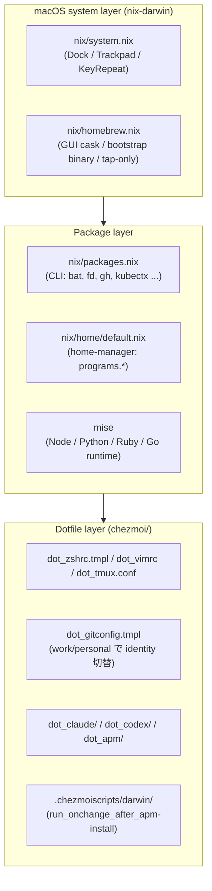
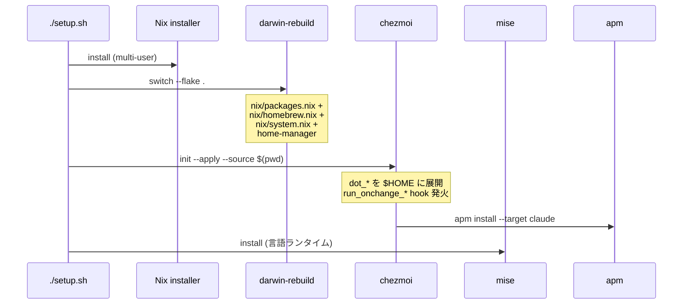

# 設計思想: nix と chezmoi の使い分け

このリポジトリは `chezmoi/` と `nix/` をトップレベルで分離した二層構成で運用している。
新しい設定を追加するときに「これは nix 側か chezmoi 側か」を毎回考えなくて済むよう、判断軸をここに固定する。
将来の自分向けの覚書。

## 1. 判断軸 TL;DR

前提として、Nix と chezmoi は「置き換え」ではなく「役割分担」。どちらが上位でもなく、`setup.sh` が両方を対等に司令する。

新しい設定を追加するときに次の3軸を順に適用すれば置き場所は機械的に決まる。

### 軸1: 存在 vs 中身

* 何かが「存在する」ことを宣言したい (バイナリ / OS defaults / GUI アプリ) → Nix
* ファイルに「何が書かれているか」を宣言したい → chezmoi

### 軸2: 共通 vs 分岐

* 全ホストで同じ値で良い → Nix で OK
* work / personal や identity で値が変わる → chezmoi の `*.tmpl` (`machineType` / hostname を参照)

### 軸3: 静的 vs 自走

* 自分だけが触る静的ファイル → 軸1, 2 で決まる
* ツールが自走で書き換える領域 → どちらも管理しない (`.chezmoiignore` で除外)

### Nix 内部の細分

* `nix/packages.nix`: nixpkgs にある CLI を全ホスト pin
* `nix/homebrew.nix`: GUI Cask / bootstrap binary (chezmoi 自身, mise) / Apple 統合が強いもの
* `nix/system.nix`: macOS system defaults (Dock / Trackpad / KeyRepeat)
* `nix/home/default.nix`: home-manager `programs.*` (型付きで pin したい複雑な設定。例: starship)
* `mise`: 言語ランタイムだけは project 単位切替が要るので Nix から外す

### オーケストレータ

* `setup.sh` が Nix と chezmoi を並立で司令する
* hostname (`scutil --get LocalHostName`) を両ツールの共有真実源にして、ホスト追加時の書き換えを1箇所に集約

## 2. 軸の詳細と境界事例

### 軸1 の本質

Nix は宣言で再現したい「存在」を扱うのが得意。flake.lock でバイナリのバージョンまで pin でき、世代単位でロールバック可能。
chezmoi はテキスト編集と per-host 値埋め込みが得意で、zshrc や gitconfig のように人が頻繁に書き換えるファイルの中身を扱うのに向く。
逆をやると無理が出る:

* Nix で zshrc 全文を declarative に書く → per-host 値の埋め込みが煩雑、編集体験が悪化
* chezmoi で CLI バイナリの version を pin → 再現性が崩れる (chezmoi はバイナリを管理しない)

### 軸2 の本質

work と personal で git の `user.email` / `signingkey` が違う、`tmux-start` の起動 dir が機械ごとに違う、といった分岐は chezmoi の `*.tmpl` で `machineType` を参照する1行で済む。
Nix にも `lib.mkIf` で条件分岐は書けるが、テンプレート埋め込みの記述量と編集のしやすさで chezmoi に分がある。

### 軸3 の本質

`.claude/projects/` (Claude Code が session 単位で生成)、`.apm/apm_modules/` (apm install が動的展開)、`.vim/plugged/` (vim-plug 自動 DL)、IDE cache はツール側が自走で書き換える。
これらを chezmoi 管理にすると drift loop に入る (chezmoi apply が上書き → ツールが書き戻す → 永久に diff が出る)。
だから chezmoi では `.chezmoiignore` で除外し、Nix 側にも持ち込まない。

### 軸1 の補強根拠: 学習コストと編集体験

軸1 で「中身は chezmoi」としている根拠は形式論だけでなく実用性にもある。

* chezmoi はテキストファイル + Go template。既存 zshrc を `git mv` でそのまま取り込めるし、単体バイナリで即動作する
* Nix で同じ中身を書くには Nix 言語と home-manager `programs.*` モジュールの習得が必要で、記述量も増える代わりに型付き宣言になる
* この非対称性を見て「型付き宣言の利益 > 学習コスト」になる複雑な設定 (例: starship) だけ home-manager に上げる、という線引きをしている

### 軸1 の派生特性: 編集頻度

軸1 を採用すると結果として、chezmoi 側には編集頻度が高いファイル (zshrc, gitconfig, claude/settings.json, claude/hooks) が集まり、Nix 側には編集頻度が低い宣言 (system defaults, パッケージリスト) が集まる傾向が出る。
これは判断軸の根拠ではなく結果だが、軸1 の判定が難しい境界事例で迷ったときの補助ヒューリスティクスとして機能する。

* 月に数回以上編集する見込み → chezmoi
* 年に数回程度しか触らない → Nix

例: starship の設定 TOML はそれなりに育ちうるが、現状は半年単位の編集頻度なので home-manager `programs.starship.settings` に寄せている。逆に zshrc の alias は週単位で増えるため chezmoi 側に置く。

### 境界事例: home-manager と mise

* `home-manager programs.*` は「中身がそこそこ複雑な設定ファイル」を Nix に上げて型付き宣言にしたケース。chezmoi でも書けるが、設定が育ちそうなら home-manager に寄せる
* `mise` は Nix の代替ではなく、「言語ランタイムだけは project 単位で切替が要る」という Nix の粒度では扱いにくい要件への割当て。`HOMEBREW_FORBIDDEN_FORMULAE` で node/python/yarn を brew 側で禁止し、衝突を防いでいる

## 3. レイヤー責任分担

各レイヤを表で再掲:

| レイヤ | 管理対象 | 配置基準 |
|---|---|---|
| nix-darwin (system) | macOS defaults / Homebrew Cask / bootstrap binary | sudo 必要、または Apple 統合が強い |
| nix packages | 安定 CLI ツール | nixpkgs にあり、バージョン pin したい |
| home-manager | `programs.*` で型付き宣言したいユーザバイナリ | 設定が複雑で declarative にしたい |
| mise | 言語ランタイム | project 単位の切替が要る |
| chezmoi | dotfile / Claude / Codex / APM 設定 | テキスト編集 + per-host 値の埋め込み |
| `.chezmoiignore` | `.claude/projects/`, `.apm/apm_modules/`, `.vim/plugged/` 等 | ツールが自走で書き換える領域 |

## 4. ホスト分岐 (hostname を共有真実源にする)

ホスト追加時に1箇所書けば nix/chezmoi の両方に伝播する設計。

* `scutil --get LocalHostName` を真実の源にする
* `setup.sh` が hostname を `work` / `personal*` / それ以外 (= `ephemeral`) の3クラスに自動分類
* nix-darwin 側: `nix/hosts/<hostname>.nix` で per-host delta (例: ホスト専用 brew パッケージ) を宣言
* chezmoi 側: `.chezmoi.toml.tmpl` で hostname → `machineType` を導出し、`dot_gitconfig.tmpl` 等で `{{ if eq .machineType "work" }}` のように分岐
* nix-darwin が `networking.hostName` を固定するため、hostname の真実性が担保される (IT 部門が払い出した hostname の影響を受けない)

## 5. Bootstrap ライフサイクル

ライフサイクルの軸:

* 初回: `setup.sh` の一本道 bootstrap
* 日次: `darwin-rebuild switch` (system / pkg) と `chezmoi apply` (dotfile) を独立に
* `apm.yml` 編集時: `chezmoi apply` で `run_onchange_*` hook が hash 差分検出して `apm install` を自動実行
* MCP サーバ追加時: `chezmoi/dot_claude/setup-mcp.sh` を手動実行 (apply に組み込まないのは、失敗時に他ツールへ波及させないため)
