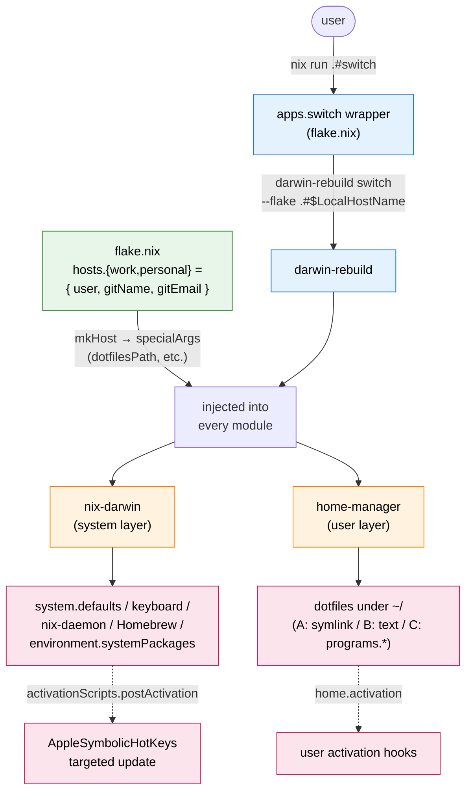
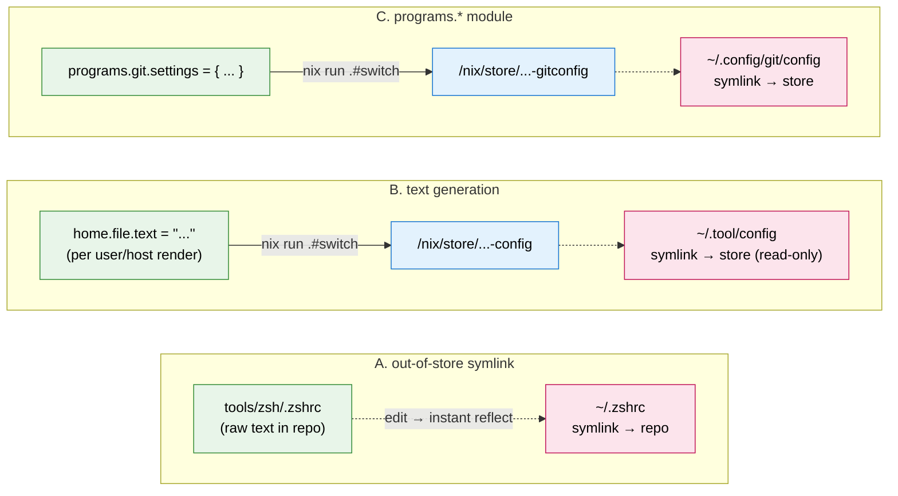
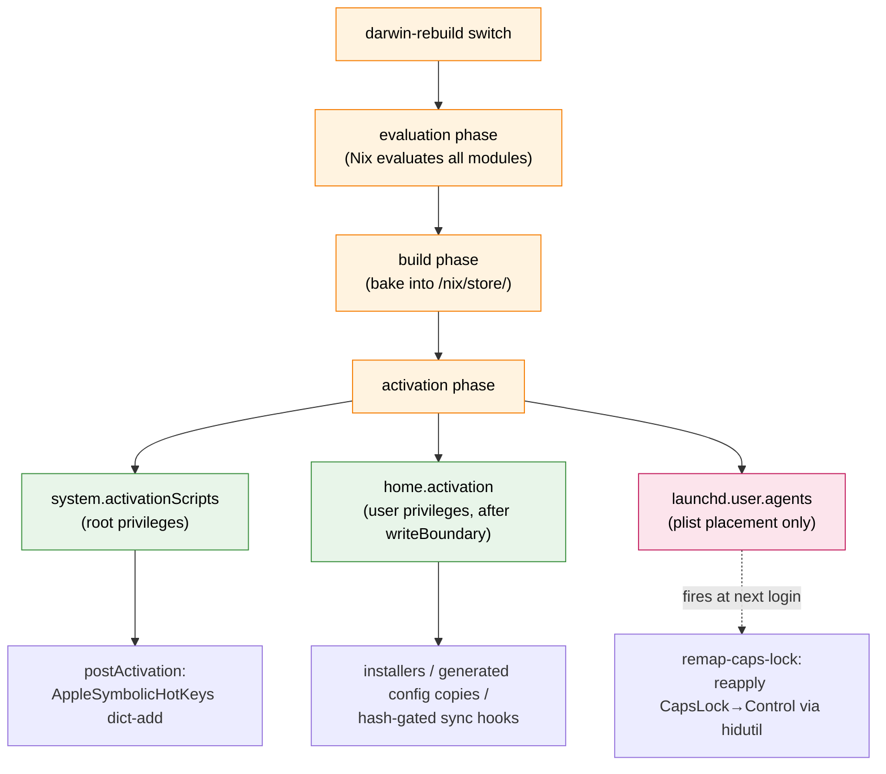

# Design Philosophy: nix-darwin + home-manager Unified

English | [日本語](design-philosophy-ja.md)

This repository runs a **two-layer stack of nix-darwin + home-manager**.
Everything under `~/` is also placed declaratively via home-manager —
that is the current policy.

## TL;DR

When adding a new piece of configuration, the placement decision boils
down to: **"Is a raw text symlink enough, or is there a motivation to use
`programs.*`?"**. The default is an out-of-store symlink; pick
`programs.*` only when one of the following applies:

* **You want to inject a Nix-evaluated value into the config body** —
  when host- or user-specific values flowing through `specialArgs` need
  to land inside the config (e.g., `programs.git` setting
  `settings.user.name = gitName;` from `specialArgs`)
* **You want home-manager to also own the binary** — tools where placing
  the config via symlink is pointless without the binary
  (e.g., `programs.mise.enable = true` puts the binary under
  `/etc/profiles/per-user/<user>/bin/`; the actual config
  `~/.config/mise/config.toml` is placed separately via the
  out-of-store symlink pattern below — a dual setup)
* **You want typed nested settings** — avoiding TOML / YAML bracket hell
  and getting type-aware completion on a Nix attrset
  (e.g., `programs.starship.settings` written as an attrset for prompt
  format)

Anything outside those three motivations gets the default **out-of-store
symlink**. Place the raw text under `tools/<tool>/` in the repo, then
symlink it via `home.file.<path>.source` using `mkOutOfStoreSymlink`
(examples: zshrc / tmux.conf / claude config / nvim / ctags / ghostty /
google-ime / markdownlint / apm / codex AGENTS.md / mise/config.toml).

As an exception, when you want Nix to render the contents (e.g., embed
host- or user-specific values with `${user}`) but no `programs.<tool>`
module exists, generate the file in-store with
`home.file.<path>.text = ''...''` (this becomes a symlink to a read-only
store file, so it suits only static config the tool never rewrites). See
section B of "The three placement patterns" below.

The decisive difference between these is "what does editing-to-apply
look like?":

| Placement | Apply step |
|---|---|
| `home.file` + `mkOutOfStoreSymlink` (out-of-store) | Edit the repo file → reflected immediately (shell reload such as `source ~/.zshrc`) |
| `home.file` + `text =` (in-store generation) / `programs.<tool>.settings` | Edit → `nix run .#switch` to reapply |

`nix run .#switch` is a shell wrapper defined under
`apps.aarch64-darwin.switch` in `flake.nix`. Internally it invokes
`darwin-rebuild switch --flake ".#$(scutil --get LocalHostName)"`, so a
bare `darwin-rebuild` is equivalent. The wrapper centralizes host
auto-resolution, the sudo pre-prompt, and nom integration (interactive
runs only). See the "Day-to-day operations" section in README for
details.

With `mkOutOfStoreSymlink`, `~/.zshrc` becomes a symlink to a file in
the repo, so opening `nvim ~/.zshrc` puts you directly into the repo.
Edit → shell reload (`source ~/.zshrc`) reflects immediately — a tight
iteration cycle that does not go through `nix run .#switch`.

## Architecture diagrams

### End-to-end apply path

Bird's-eye view of how `nix run .#switch` cascades side-effects into the
system and user layers. The values declared under the `hosts` attrset
flow into every module via `specialArgs`, and `darwin-rebuild` applies
nix-darwin (system layer) and home-manager (user layer) in a single
transaction.



### Three placement patterns and reflection paths

User-layer dotfiles reach `~/` via three routes. Only A reflects an
edit immediately without going through `nix run .#switch` — that is the
primary motivation for choosing out-of-store symlink as the default.
B / C go through the Nix store, so an edit requires re-evaluation,
rebaking the store, and swapping the `~/` symlink — i.e.,
`nix run .#switch` is required.



### Activation firing order at apply time

Firing order and scope of the hooks that run during
`darwin-rebuild`'s activation phase. Note that `launchd.user.agents` is
not an activation hook — apply only drops a plist under
`~/Library/LaunchAgents/`, and the actual command fires at the next
login (an asynchronous path).



## Directory layout

```
dotfiles/
├── flake.nix                      # darwinConfigurations.{work,personal,...}
├── flake.lock
├── nix/
│   ├── darwin/                    # nix-darwin (system layer)
│   │   ├── default.nix            # imports the 6 files below
│   │   ├── macos-defaults.nix     # system.defaults.* (Dock / Finder /
│   │   │                           # NSGlobalDomain / trackpad / WindowManager
│   │   │                           # / menuExtraClock / CustomUserPreferences)
│   │   ├── keyboard.nix           # system.keyboard (CapsLock → Control HID
│   │   │                           # remap) / launchd.user.agents (hidutil
│   │   │                           # reapply at login) / system.activationScripts.
│   │   │                           # postActivation (targeted update of
│   │   │                           # AppleSymbolicHotKeys)
│   │   ├── nix-daemon.nix         # nix.settings + nix.gc +
│   │   │                           # environment.variables (SSL CA bundle etc.)
│   │   ├── system.nix             # primaryUser / users.users / programs.zsh
│   │   │                           # disable / system.stateVersion (residual)
│   │   ├── packages.nix           # Nix store CLI
│   │   ├── homebrew.nix           # GUI cask + tap-only / Apple-integrated formulae
│   │   └── hosts/
│   │       ├── work.nix           # networking.hostName enforcement (per host)
│   │       └── personal.nix
│   └── home/
│       ├── default.nix            # imports + home.{stateVersion,username,homeDirectory}
│       └── programs/              # one tool per file
│           ├── zsh.nix            # ~/.zshrc symlink
│           ├── git.nix            # programs.git + ignores + includeIf
│           ├── tmux.nix           # ~/.tmux.conf, ~/.tmux_start_dir, ~/.local/bin/tmux-start
│           ├── nvim.nix           # symlinks the entire ~/.config/nvim to tools/nvim/ (lazy.nvim + nvim-lspconfig)
│           ├── claude.nix         # ~/.claude/* (excluding dynamic areas) + claudeCodeInstall hook (~/.local/bin/claude)
│           ├── codex.nix          # ~/.codex/* (config.toml generated via pkgs.formats.toml, mutable-copied by codexConfig hook /
│           │                        # AGENTS.md symlinks tools/codex/AGENTS.md (→ tools/claude/CLAUDE.md) / mcp_servers read from tools/mcp/servers.json. apm skills go to ~/.agents/skills/) + codexInstall hook (~/.local/bin/codex)
│           ├── apm.nix            # ~/.apm/* + home.activation.apmInstall hook
│           ├── mise.nix           # programs.mise + ~/.config/mise/config.toml + miseTrust hook
│           ├── markdownlint.nix   # ~/.markdownlint.jsonc symlink
│           ├── starship.nix       # programs.starship.settings
│           ├── ghostty.nix        # ~/Library/Application Support/com.mitchellh.ghostty/config
│           ├── ctags.nix          # ~/.ctags.d/exclude.ctags
│           ├── vscode.nix         # ~/Library/Application Support/Code/User/{settings,keybindings}.json + extensions hook
│           └── google-ime.nix     # ~/.config/google-ime/keymap.tsv
├── tools/                         # per-tool raw text dotfiles (consumed by nix/home/programs/*.nix)
│   ├── zsh/.zshrc
│   ├── tmux/{.tmux.conf, .tmux_start_dir, bin/tmux-start}
│   ├── nvim/{init.lua, lazy-lock.json, lua/{options,mappings,autocmds}.lua, lua/plugins/*.lua, after/ftplugin/*.lua}
│   ├── claude/{CLAUDE.md, settings.json, hooks/, rules/, skills/.gitignore, .env.example, setup-mcp.sh}
│   ├── codex/{AGENTS.md (→ ../claude/CLAUDE.md)}
│   ├── mcp/servers.json              # MCP server definitions shared by claude/codex (single source of truth)
│   ├── apm/{apm.yml, apm.lock.yaml, .gitignore}
│   ├── mise/config.toml
│   ├── markdownlint/.markdownlint.jsonc
│   ├── ghostty/config
│   ├── google-ime/keymap.tsv
│   ├── ctags/exclude.ctags
│   └── vscode/{settings.jsonc, keybindings.jsonc, extensions.txt, sync.sh}
├── setup.sh                       # initial bootstrap
└── docs/                          # design documents
```

## The three placement patterns

### A. out-of-store symlink (most dotfiles)

`home.file."<path>".source = config.lib.file.mkOutOfStoreSymlink "${dotfilesPath}/tools/<tool>/<file>"`.
Constructs the repo's absolute path from the user variable
(`/Users/${user}/Documents/dev/dotfiles`) and symlinks `~/<path>`
directly to the repo file.

* **Editing experience**: open the repo file via `nvim ~/.zshrc` → edit
  → `source ~/.zshrc` reflects immediately
* **No `nix run .#switch` needed**: content changes update only the
  symlink target's body
* **Where to use**: zsh / tmux / nvim / claude (CLAUDE.md /
  settings.json / hooks / rules / mcp-servers.json) / codex AGENTS.md /
  apm (apm.yml / apm.lock.yaml / .gitignore) / tools/mise/config.toml /
  markdownlint / ghostty / google-ime / ctags

### B. text generation (text =)

`home.file."<path>".text = ''...''`. home-manager bakes the actual file
into the Nix store, and `~/<path>` becomes a symlink there.

* **Where to use**: when the body needs to be rendered per user / host
  via Nix `${user}` and friends, and the tool does not rewrite the config
  itself. codex `config.toml` used to live here, but since codex appends
  trust at startup it moved to a mutable copy via an activation hook (from
  a `pkgs.formats.toml` output)
* **Trade-off**: editing means rewriting `text = ''...''` inside
  `nix/home/programs/<tool>.nix` → `nix run .#switch` required

### C. declarative module (programs.\*)

`programs.<tool>.{enable, settings, ...}`. home-manager interprets the
module and emits the file at the right path.

* **Where to use** (when one of the three motivations in TL;DR
  applies):
  * Inject a Nix-evaluated value into config (e.g.,
    `programs.git.settings.user.name = gitName;`)
  * Let home-manager own the binary too (e.g., `programs.mise.enable`;
    config `~/.config/mise/config.toml` is the dual raw-text-symlink
    side)
  * Typed nested settings (e.g., `programs.starship.settings`)
* **Trade-off**: same as B (`nix run .#switch` required). The
  edit-to-apply cycle is slower than raw text

## Handling dynamic areas

Areas that tools rewrite on their own (Claude Code's
`~/.claude/projects/`, codex's `~/.codex/sessions/`, lazy.nvim's
`~/.local/share/nvim/lazy/`, nvim-treesitter's
`~/.local/share/nvim/site/parser/`, apm's `~/.apm/apm_modules/`) are
**out of home.file's scope** — they stay under `~/` as plain mutable
directories. home-manager does not touch their placement.

This ensures:

* The tools' self-rewrites do not clash with home-manager's symlink
  placement
* User data survives `nix run .#switch`
* No dynamic content flows back into the repo (= `git status` stays
  clean)

## Secrets design

The repo is intended to be public, so secrets are never tracked. Two
injection paths exist:

* **MCP server registration + `tools/claude/.env`** (env values for
  Claude Code MCP servers):
  `tools/claude/setup-mcp.sh` sources the in-repo
  `tools/claude/.env` and injects the values as the `env:` of each
  server in `tools/mcp/servers.json`. Note that it reads
  **the in-repo `tools/claude/.env`**, not `~/.claude/.env` (because
  the script expects to be run as
  `cd tools/claude && ./setup-mcp.sh` and reads `${SCRIPT_DIR}/.env`).
  `tools/claude/.env` is in `.gitignore`;
  `tools/claude/.env.example` is tracked as the template. For the
  list of env vars actually used, look at
  `tools/claude/.env.example` directly.
* **Handwritten dispatcher + overrides** (work git identity):
  the repo's `programs.git.includes` only unconditionally includes
  `~/.gitconfig.local` (user-handwritten, outside the repo). Both the
  conditional logic (which remote URL pattern flips identity) and the
  override values (the `[user]` block in `~/.gitconfig.work`) are
  written on the user side. The organization name and work email never
  appear in the repo. See README for the procedure.

`.env` files are tracked only as `.env.example`; new machines need one
manual step of copy + filling in values. If we ever want declarative
secrets via sops-nix / agenix, that is a separate task.

## Per-host branching

`work` / `personal` differ in `user` (macOS account name) and git
identity (`gitName` / `gitEmail`), so each host is declared as one entry
under `hosts` in `flake.nix`:

```nix
hosts = {
  "work"     = { user = "hideaki.ishii"; gitName = "danimal141"; gitEmail = "..."; };
  "personal" = { user = "danimal141";    gitName = "danimal141"; gitEmail = "..."; };
};
```

`mkHost` flows these through `specialArgs` to every module
(system / home / `hosts/<hostname>.nix`). Adding a machine takes just
one more entry.

`networking.hostName` is enforced by `nix/darwin/hosts/<hostname>.nix`
(overriding whatever the IT department assigned), and
`scutil --get LocalHostName` is the source of truth for the flake host.

## Declarative side-effects at apply time

### What "activation" means

`darwin-rebuild` (= `nix run .#switch`) runs in three phases:
**evaluation → build → activation**. Activation is the final phase that
"applies the pure Nix evaluation / build output to the actually running
system". The last diagram in the Architecture-diagrams section
(activation firing order) decomposes exactly these three phases.

* Evaluation phase — Nix evaluates all modules from `flake.nix` and
  produces a derivation tree. Pure functions only, no side-effects
* Build phase — derivations are realized and the artifacts (config
  files / binaries / scripts) are baked into `/nix/store/...`. This runs
  in Nix's sandbox, so `~/` and macOS defaults remain untouched
* Activation phase — the `/run/current-system` symlink is swapped to the
  new store path and the attached activation scripts fire in order.
  Only here do user-visible changes happen (`~/.zshrc` symlink swap /
  `defaults write` / `brew bundle` etc.)

Why is this a separate phase? Nix builds are pure functions that run
inside a sandbox, so external mutations like `defaults write` /
`brew bundle` / swapping symlinks under `~/` cannot be invoked from
build. Activation scripts exist precisely to separate "produce the
artifact (build)" from "mutate the outside world (activation)", with
the latter firing as root / user in a controlled order.

In other words, **build complete ≠ reflected**: until activation finishes,
`~/.zshrc` and macOS defaults remain stale. The out-of-store symlink
pattern (placement A) is the only one where, once the symlink is
swapped to a repo raw-text target, subsequent edits land directly via
filesystem write without needing another activation — that is what
makes pattern A's iteration cycle short.

The side-effects driven via activation are split across the routes
below by responsibility and firing moment:

### home-manager `home.activation.<name>`

home-manager's user-side activation path. Runs as the user after
`activate`'s `writeBoundary`.

* `apmInstall` (apm.nix): stores the sha256 of `~/.apm/apm.yml` in
  `~/.apm/.apm.yml.hash` and fires `apm install --target claude,codex` only
  when it differs (idempotent)
* `miseTrust` (mise.nix): registers the repo path
  `tools/mise/config.toml` in mise's trust store (workaround for the
  out-of-store symlink being treated as an external path)
* Installer / sync hooks for tools that need mutable files or external
  state, such as Claude Code, Codex, sheldon, and VSCode extensions

Hooks call binaries via direct `pkgs.<tool>` paths where possible to
avoid PATH dependence. apm lives under nix-darwin's
`environment.systemPackages`, so a PATH export to
`/run/current-system/sw/bin` is added.

### system `system.activationScripts.postActivation`

nix-darwin's system-activation path, running as root (using
`launchctl asuser` together with `sudo --user=...` to switch to the
target user and emit individual commands).

* Targeted update of the input source switch shortcut
  (`AppleSymbolicHotKeys` IDs 60 / 61) via
  `defaults write -dict-add`. The `AppleSymbolicHotKeys` dict houses
  Spotlight / Mission Control / Screenshot and many others, so writing
  it through `system.defaults.CustomUserPreferences` would overwrite
  the entire dict. To avoid that, per-key dict-add is used. See the
  relevant section in `nix/darwin/keyboard.nix`.

### `launchd.user.agents.<name>`

Not an activation hook but a LaunchAgent path that drops a plist under
`~/Library/LaunchAgents/`. Used to fire a one-shot command at login via
`RunAtLoad`.

* `remap-caps-lock`: persistence helper for
  `system.keyboard.remapCapsLockToControl`.
  `hidutil property --set` is session-scoped and lost across reboots
  (Apple TN2450), so the same payload is reapplied at every login.
  Without this, after "bootstrap a new Mac → reboot" the CapsLock
  remap reverts.
