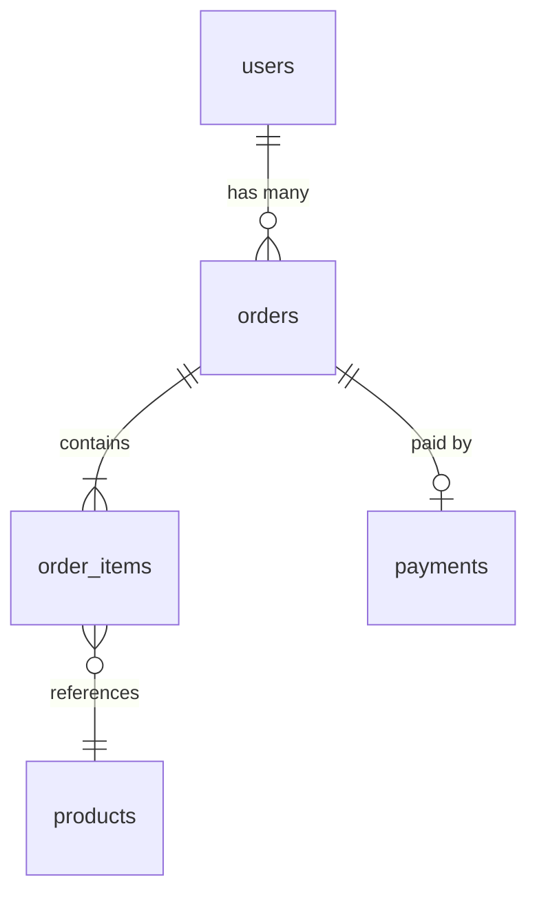
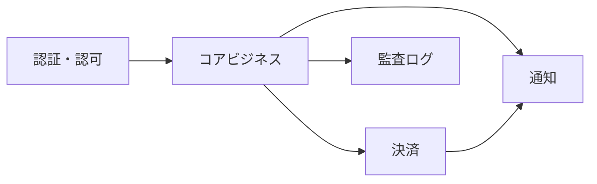

# ドメインエクスプローラー

データベーススキーマを起点に、プロジェクトのドメインモデルを体系的に解説する。
スキーマ定義を全て読み込み、テーブルをドメイン領域ごとにグルーピングし、
各ドメインの目的・リレーション・典型的なクエリパターンをSQL例付きで提示する。

## 使うべきとき

- 初めて触るプロジェクトのデータ構造を理解したいとき
- ドメイン駆動設計（DDD）の文脈で集約境界を検討するとき
- 新メンバーにデータモデルを説明する資料が欲しいとき
- テーブル間のリレーションを可視化したいとき
- 「このテーブル何に使ってるの？」が複数テーブルに及ぶとき

## 使うべきでないとき

- 特定のSQLクエリの最適化だけが目的（通常のコーディング支援を使う）
- スキーマが存在しないプロジェクト（NoSQL専用、設定ファイルのみ等）
- 単一テーブルの定義確認（直接スキーマファイルを読めばよい）

---

## 分析フロー

### ステップ 1: スキーマ定義の発見と全量読み込み

プロジェクト内のスキーマ定義ファイルを探し、全て読み込む。

#### 探索対象（優先順）

| フレームワーク | ファイル | 備考 |
|-------------|---------|------|
| Rails | `db/schema.rb` | 最も情報量が多い。全テーブル定義が1ファイルにまとまる |
| Rails | `db/structure.sql` | SQL形式のスキーマダンプ |
| Prisma | `prisma/schema.prisma` | モデル定義とリレーションが明示的 |
| Django | `*/models.py` | 各アプリのmodels.pyを収集 |
| Laravel | `database/migrations/*.php` | マイグレーション群から復元 |
| TypeORM/MikroORM | `src/**/*entity*.ts`, `src/**/*model*.ts` | デコレータからスキーマを読む |
| Sequelize | `src/models/*.js` | define()からスキーマを読む |
| Go (sqlc/ent) | `schema/*.go`, `*.sql` | SQLまたはGoのスキーマ定義 |
| SQL直接 | `*.sql`, `migrations/*.sql` | DDLファイル群 |

```bash
# 一括探索
find . -maxdepth 5 \
  \( -name "schema.rb" -o -name "structure.sql" -o -name "schema.prisma" \
     -o -name "models.py" -o -path "*/migrations/*.sql" \
     -o -name "*.entity.ts" -o -name "schema.sql" \) \
  -not -path "*/node_modules/*" -not -path "*/.git/*" -not -path "*/vendor/*" \
  2>/dev/null
```

スキーマファイルが見つかったら、全量を読み込む。
部分的な読み込みではドメイン間の関係が見えなくなるため、
スキーマ定義については省略せず全て読む。

#### Enum値の解決

スキーマ上で `integer` だがアプリケーション側でenumとして扱われているカラムを特定し、
各整数値の意味をマッピングする。これはスキーマだけでは判別できないため、
モデル/エンティティのソースコードも合わせて読む必要がある。

探索パターン（フレームワーク別）：

```bash
# Rails: enum定義（モデルファイル内）
grep -rn "enum\s" app/models/ --include="*.rb" 2>/dev/null

# Rails 7+: enum メソッド形式
grep -rn "enum.*:" app/models/ --include="*.rb" 2>/dev/null

# Laravel: Casts や Enum クラス
grep -rn "protected \$casts" app/Models/ --include="*.php" 2>/dev/null
find . -path "*/Enums/*.php" 2>/dev/null

# Prisma: enum定義（schema.prisma内に定義されている）
grep -A 10 "^enum " prisma/schema.prisma 2>/dev/null

# TypeScript: enum / const object
grep -rn "enum\s\|as const" --include="*.ts" src/ 2>/dev/null

# Python/Django: choices / TextChoices / IntegerChoices
grep -rn "choices\|TextChoices\|IntegerChoices" --include="*.py" 2>/dev/null

# Go: iota パターン
grep -rn "iota" --include="*.go" 2>/dev/null
```

Rails の例：
```ruby
# app/models/order.rb
class Order < ApplicationRecord
  enum status: { draft: 0, pending: 1, confirmed: 2, shipped: 3, delivered: 4, cancelled: 5 }
  enum payment_method: { credit_card: 0, bank_transfer: 1, convenience_store: 2 }, _prefix: true
end
```

この場合、レポートには以下のように記載する：

```markdown
#### Enum定義: orders

| カラム | 値 | ラベル | 説明 |
|-------|---:|-------|------|
| status | 0 | draft | 下書き |
| status | 1 | pending | 確認待ち |
| status | 2 | confirmed | 確定済み |
| status | 3 | shipped | 発送済み |
| status | 4 | delivered | 配達完了 |
| status | 5 | cancelled | キャンセル |
| payment_method | 0 | credit_card | クレジットカード |
| payment_method | 1 | bank_transfer | 銀行振込 |
| payment_method | 2 | convenience_store | コンビニ決済 |
```

Serenaモードでは `mcp__serena__find_symbol` で各モデルのenum定義を
直接取得できるため、grepより正確かつ高速に解決できる。

### ステップ 2: テーブル/モデルの一覧化と分類

読み込んだスキーマから全テーブルを一覧化し、ドメイン領域に分類する。

#### 分類の基準

- テーブル名のプレフィックス/サフィックスからの推測
  （例: `user_*` → ユーザードメイン、`order_*` → 注文ドメイン）
- 外部キー関係からの推測（密結合なテーブル群は同一ドメイン）
- 命名規則のパターン（`*_logs`, `*_histories` → 監査/ログドメイン）
- フレームワーク固有のテーブル（`ar_internal_metadata`, `schema_migrations`,
  `_prisma_migrations` 等）はインフラテーブルとして分離

#### 典型的なドメイン分類例

- 認証・認可（users, roles, permissions, sessions, oauth_*)
- コアビジネス（プロジェクト固有の中心エンティティ群）
- 決済・課金（payments, subscriptions, invoices, plans）
- 通知（notifications, notification_settings, devices）
- 監査・ログ（audit_logs, *_histories, versions）
- システム（マイグレーション管理、設定値、ジョブキュー）

### ステップ 3: ドメインごとの詳細分析

各ドメインについて以下を記述する。

#### 3a. ドメイン概要

- このドメインが扱うビジネス概念（1〜2文）
- 含まれるテーブル一覧
- 他ドメインとの関係

#### 3b. テーブル構造

各テーブルについて：
- テーブル名と目的
- 主要カラム（PK, FK, ビジネスキー, ステータス, タイムスタンプ）
- インデックス（ユニーク制約、複合インデックスは特に注目）
- ENUMやチェック制約があれば、取りうる値
- integer enumカラムがあれば、ステップ1で収集した値マッピングを記載

#### 3c. リレーション図

ドメイン内のテーブル関係をMermaid ER図で表現する。

````markdown

````

#### 3d. 典型的なSQLクエリ例

そのドメインでよく書かれるであろうクエリを3〜5個、SQL例として提示する。
「このテーブルをどう使うか」を具体的に示すことが目的。

提示するクエリの種類：
- 基本的な一覧取得（フィルタ・ソート付き）
- リレーションを辿るJOIN
- 集計・レポート系
- ステータス遷移に関わる更新
- よくあるサブクエリパターン

例（注文ドメインの場合）：

```sql
-- ユーザーの注文履歴（最新順、関連テーブル結合）
SELECT
    o.id,
    o.status,
    o.total_amount,
    o.created_at,
    COUNT(oi.id) AS item_count
FROM orders o
JOIN order_items oi ON oi.order_id = o.id
WHERE o.user_id = :user_id
GROUP BY o.id, o.status, o.total_amount, o.created_at
ORDER BY o.created_at DESC
LIMIT 20;

-- 月別売上集計
SELECT
    DATE_TRUNC('month', o.created_at) AS month,
    COUNT(DISTINCT o.id) AS order_count,
    SUM(o.total_amount) AS revenue,
    COUNT(DISTINCT o.user_id) AS unique_buyers
FROM orders o
WHERE o.status = 'completed'
  AND o.created_at >= :start_date
GROUP BY DATE_TRUNC('month', o.created_at)
ORDER BY month DESC;

-- 未完了注文のアラート（24時間以上放置）
SELECT o.id, o.user_id, o.status, o.created_at
FROM orders o
WHERE o.status IN ('pending', 'processing')
  AND o.created_at < NOW() - INTERVAL '24 hours'
ORDER BY o.created_at ASC;
```

SQL例の方言はプロジェクトのDBに合わせる：
- PostgreSQL: `DATE_TRUNC`, `INTERVAL '1 day'`, `::timestamp`
- MySQL: `DATE_FORMAT`, `INTERVAL 1 DAY`, `CAST()`
- SQLite: `strftime`, `datetime('now', '-1 day')`
- 不明な場合はPostgreSQL方言をデフォルトとし、冒頭に注記する

### ステップ 4: クロスドメイン分析

ドメインを横断する観点で以下を分析する。

#### 4a. ドメイン間リレーションマップ

全ドメイン間の関係をMermaid図で表現する。

````markdown

````

#### 4b. 集約境界の推定

DDD的な観点で、どのテーブル群が1つの集約（Aggregate）を形成しそうかを推定する。
根拠は外部キー制約とカスケード設定から判断する。

#### 4c. 注目ポイント

- 多態的関連（polymorphic association）の存在
- 中間テーブル（多対多）のパターン
- STI（Single Table Inheritance）の使用
- JSONカラムの活用箇所
- ソフトデリート（`deleted_at`）の有無
- マルチテナント（`tenant_id`, `organization_id`）の構造

### ステップ 5: Serenaモード追加分析（利用可能な場合）

Serena MCPが接続されている場合、以下の追加分析を行う。

1. `mcp__serena__find_symbol` でモデルクラスの定義を特定
2. `mcp__serena__get_symbols_overview` でモデルクラスの全メソッド一覧を取得
   - スコープ、バリデーション、コールバック、カスタムメソッドを把握
3. `mcp__serena__find_referencing_symbols` で各モデルの参照元を特定
   - 「このモデルはどのサービス/コントローラから使われているか」を可視化

---

## 出力フォーマット

`.claude/reports/domain-analysis.md` に出力する。

```markdown
# ドメインモデル分析レポート

**生成日時**: YYYY-MM-DD
**リポジトリ**: 名前
**DB**: PostgreSQL / MySQL / SQLite / 不明
**スキーマソース**: db/schema.rb / prisma/schema.prisma / etc.
**テーブル総数**: N

## テーブル一覧（ドメイン別）

| ドメイン | テーブル数 | 主要テーブル |
|---------|----------|------------|
| 認証・認可 | 5 | users, roles, ... |
| コアビジネス | 12 | orders, products, ... |
| ... | ... | ... |

## ドメイン詳細

### 1. [ドメイン名]

[概要]

#### テーブル構造
[各テーブルの説明]

#### Enum定義
[integer enumの値マッピング表]

#### リレーション図
[Mermaid ER図]

#### 典型的なSQL
[3〜5個のクエリ例]

---

### 2. [次のドメイン名]
...

## クロスドメイン分析

### ドメイン間リレーションマップ
[Mermaid図]

### 集約境界の推定
[DDD的な分析]

### 注目ポイント
[特殊パターンの指摘]
```

---

## 実行ガイドライン

- スキーマは全量読み込む。スキーマだけはケチらない。
  テーブル定義を部分的に読むと、ドメイン間のリレーションを見落とす。
- SQL例はそのプロジェクトで実際に使われそうな実用的なものにする。
  教科書的な `SELECT * FROM users` ではなく、
  ビジネスロジックが透けて見えるクエリを書く。
- ドメイン分類に迷ったら、外部キー関係を最優先の判断基準にする。
  テーブル名の推測だけでは誤分類しやすい。
- テーブル数が100を超える場合は、まずドメイン分類の概要を示し、
  詳細分析は主要ドメイン（テーブル数上位5〜7ドメイン）に絞る。
  残りは付録で一覧だけ記載する。
- Serenaが利用可能なら、モデルクラスのメソッド一覧取得に積極的に使う。
  スキーマからは読めない「ビジネスロジック」が見えてくる。

### コンテキスト制限への対策

大規模スキーマ（50テーブル超）ではコンテキストウィンドウを使い切るリスクがある。
精度を落とさずに完走するため、以下の「段階書き出し＋サブエージェント分割」戦略を採る。

#### 原則: メインコンテキストにはインデックスだけ残す

1. ステップ1（スキーマ読み込み）とステップ2（分類）はメインで実行する。
   スキーマ全量を読み、ドメイン分類まで完了したら、
   分類結果（ドメイン名、所属テーブル名、FK関係の要約）だけを
   レポートファイルに書き出す。
2. スキーマの生テキストはこの時点でコンテキストから押し出されてよい。
   以降のステップでは、レポートに書き出した分類結果を参照する。

#### ドメインごとにサブエージェントへ委譲

ステップ3（ドメイン詳細分析）が最もトークンを消費する。
ドメインが4つ以上ある場合、各ドメインの詳細分析を
Taskツール（subagent_type: general-purpose）に委譲する。

各サブエージェントへの指示テンプレート：

```
以下のドメインについてレポートセクションを作成し、
.claude/reports/domain-analysis.md の該当箇所に追記せよ。

ドメイン名: [名前]
所属テーブル: [テーブル名リスト]
スキーマファイル: [パス]
DB方言: [PostgreSQL/MySQL/SQLite]

作成するセクション:
1. ドメイン概要（1〜2文）
2. 各テーブルのカラム構造（スキーマファイルの該当部分を読んで記述）
3. Enum定義（モデルファイルからinteger enumの値マッピングを収集）
4. Mermaid ER図
5. 典型的なSQL例 3〜5個

SQLはDB方言に合わせること。Enum値はSQLコメントで意味を注記すること。
```

サブエージェントは並列実行可能（独立したドメインなので依存関係なし）。
これにより：
- メインコンテキストはドメイン分類＋クロスドメイン分析だけ保持
- 各ドメイン詳細は個別のサブエージェントコンテキストで処理
- サブエージェント内ではスキーマの該当部分だけ読むのでトークン効率が良い

#### ステップ4以降はメインに戻す

クロスドメイン分析（ステップ4）はドメイン横断の視点が必要なため、
メインコンテキストで実行する。ただしこの時点でのインプットは
レポートファイルに書き出されたドメイン詳細の要約であり、
スキーマ生テキストを再度読む必要はない。

#### フォールバック: サブエージェントなし

テーブル数が少ない（30テーブル以下）、またはドメインが3つ以下の場合は、
サブエージェント分割のオーバーヘッドの方が大きい。
メインコンテキストで全ステップを実行し、
各ステップ完了時にレポートへ書き出すだけで十分。
