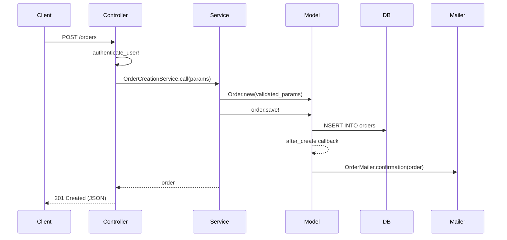
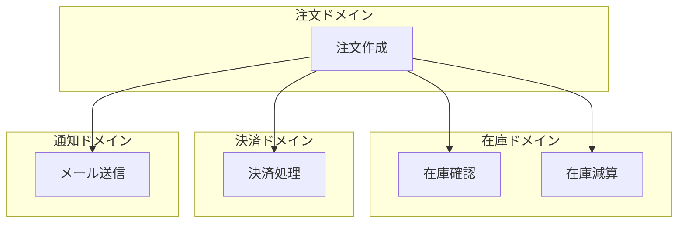

# ユースケース・ウォークスルー

主要ドメインの代表的なユースケースについて、処理の流れを端から端まで追跡し、
シンボルレベルの呼び出しチェーンとして解説する。

このスキルは「コードベースが何をしているか」ではなく、
「ある操作が発生したとき、コードがどう動くか」を明らかにする。

## 使うべきとき

* 初めて触るプロジェクトで「この機能はどう動いているのか」を理解したいとき
* 特定のユースケースに関わるファイル群を把握したいとき
* バグ修正や機能追加の前に、影響範囲を正確に理解したいとき
* 新メンバーへのオンボーディング資料として処理フロー図が欲しいとき
* コードレビューで「この変更が他にどう影響するか」を確認したいとき

## 使うべきでないとき

* プロジェクト全体のアーキテクチャ概要だけが欲しいとき（→ codebase-deep-dive を使う）
* データベーススキーマの構造だけが知りたいとき（→ domain-explorer を使う）
* 単一メソッドの実装を読むだけのとき（直接コードを読めばよい）

---

## ツールモード: 標準モード と Serenaモード

codebase-deep-dive と同様に2つのモードで動作する。フェーズ0で自動判定する。

### 標準モード（デフォルト）
`grep`, `find`, `Glob`, `Read` などClaude Code標準のツールのみでフローを追跡する。

### Serenaモード（推奨・自動昇格）
Serena MCP が接続されている場合に自動的にこちらを使う。
`find_symbol`, `find_referencing_symbols`, `get_symbols_overview` により、
grep では不可能なシンボルレベルの正確な呼び出しチェーン追跡が可能になる。

---

## 分析フェーズ

### フェーズ 0: 準備と前提レポートの確認

#### 0a. 出力ファイルの準備

```bash
mkdir -p .claude/reports
touch .claude/reports/usecase-walkthrough.md
```

#### 0b. Serena検出

codebase-deep-dive と同じ手順で Serena MCP の利用可否を判定する。

1. `mcp__serena__get_current_config` を呼び出して応答を確認する
2. 接続されていれば `mcp__serena__check_onboarding_performed` でオンボーディング状態を確認する
3. 未オンボーディングの場合は `mcp__serena__onboarding` を実行する

#### 0c. 前提レポートの確認と生成

このスキルは codebase-deep-dive と domain-explorer の分析結果を基盤にする。
以下の順で確認する。

1. `.claude/reports/codebase-analysis.md` の存在を確認する
2. `.claude/reports/domain-analysis.md` の存在を確認する

**両方存在する場合**: レポートを読み込み、フェーズ1に進む。

**いずれかが存在しない場合**: 不足しているレポートの生成に必要な分析を内部で実行する。
ただし完全なスキル実行ではなく、ユースケース追跡に必要な情報に絞った軽量版を実行する。

必要な情報:
* codebase-analysis.md が不足 → フェーズ1〜3相当（プロジェクト概要、アーキテクチャ、主要機能）を実行
* domain-analysis.md が不足 → ステップ1〜2相当（スキーマ読み込み、ドメイン分類）を実行

軽量版で生成した情報はレポートファイルに書き出す（次回以降の再利用のため）。
ただしファイル名にはサフィックスを付けて区別する:
* `.claude/reports/codebase-analysis-lite.md`
* `.claude/reports/domain-analysis-lite.md`

完全版のレポートが既にある場合はそちらを優先する。

#### 0d. レポートのヘッダー初期化

```markdown
# ユースケース・ウォークスルーレポート

生成日時: [日付]
リポジトリ: [名前]
分析者: Claude Code (usecase-walkthrough スキル)
分析モード: [Serena（LSPセマンティック分析） / 標準（grep/find）]
ベースレポート:
  * コードベース分析: [codebase-analysis.md / codebase-analysis-lite.md / 新規生成]
  * ドメイン分析: [domain-analysis.md / domain-analysis-lite.md / 新規生成]
```

### フェーズ 1: ドメインとユースケースの特定

前提レポートから以下を抽出する。

#### 1a. ドメイン一覧の取得

codebase-analysis.md の「3. 主要機能」と domain-analysis.md の「テーブル一覧（ドメイン別）」から
ドメイン領域を一覧化する。

#### 1b. ユースケース候補の特定

各ドメインについて代表的なユースケースを特定する。
特定の方法（優先順）:

1. ルーティング定義からCRUD操作を抽出する
   ```bash
   # Rails
   grep -n "resources\|post\|get\|put\|patch\|delete" config/routes.rb 2>/dev/null
   # Express/Koa
   grep -rn "router\.\(get\|post\|put\|delete\)" --include="*.ts" --include="*.js" | head -50
   # Next.js
   find . -path "*/app/api/*/route.*" | head -30
   # Go
   grep -rn "HandleFunc\|Handle\|\.GET\|\.POST" --include="*.go" | head -50
   ```

2. コントローラ/ハンドラのアクション一覧を取得する
   * Serenaモード: `mcp__serena__get_symbols_overview` でアクション一覧
   * 標準モード: `grep` でメソッド定義を抽出

3. バックグラウンドジョブを探す（非同期ユースケース）
   ```bash
   # Sidekiq/ActiveJob
   grep -rn "perform\|perform_later\|perform_async" --include="*.rb" | head -20
   # Bull/BullMQ
   grep -rn "queue\.\(add\|process\)" --include="*.ts" --include="*.js" | head -20
   ```

#### 1c. ユースケースの選定

各ドメインから1〜3個の代表的なユースケースを選ぶ。
選定基準:

* ドメインのコア操作であること（CRUD の C や U が優先。R だけのものは後回し）
* 複数レイヤーを横断する処理であること（Controller→Service→Model→DB）
* 副作用（通知送信、イベント発行、外部API呼び出し等）を含むものが望ましい
* ドメイン間連携があるものが望ましい

選定結果をレポートに記載する:

```markdown
## 分析対象ユースケース

| # | ドメイン | ユースケース | エントリーポイント | 選定理由 |
|---|---------|------------|------------------|---------|
| 1 | 注文 | 注文を作成する | POST /orders | コアCRUD、決済・在庫連携あり |
| 2 | ユーザー | ユーザー登録 | POST /users | 認証フロー、メール送信あり |
| ... | ... | ... | ... | ... |
```

ユーザーが特定のユースケースを指定している場合はそれを優先する。

### フェーズ 2: ユースケースごとのフロー追跡

各ユースケースについて以下の手順でフローを追跡する。
このフェーズが最もトークンを消費するため、ドメインが多い場合は
サブエージェント（Task ツール、subagent_type: general-purpose）へ委譲する。

#### 2a. エントリーポイントの特定

ユースケースの起点となるコード（ルーティング定義 → コントローラ/ハンドラ）を特定する。

* Serenaモード: `mcp__serena__find_symbol` でコントローラクラスとアクションメソッドを特定し、
  `include_body=True` でアクション本体を読む
* 標準モード: ルーティングからコントローラファイルを特定し、`Read` でアクションメソッドを読む

#### 2b. 呼び出しチェーンの追跡

エントリーポイントから呼び出されるメソッドを順に辿る。

追跡するレイヤー:

```
[HTTP Request]
  → Middleware / Before Action
    → Controller Action
      → Form Object / Request Validation
        → Service / Use Case / Interactor
          → Domain Model / Entity
            → Repository / Query
              → [Database]
          → External Service Client
            → [External API]
          → Event / Callback
            → Job / Worker
              → [Background Processing]
          → Notification / Mailer
            → [Email / Push / Slack]
    → Serializer / Presenter / View
  → [HTTP Response]
```

Serenaモードの追跡手順:

1. エントリーポイントのアクション本体を `mcp__serena__find_symbol` (`include_body=True`) で取得
2. 本体内で呼ばれているメソッド/クラスを抽出
3. 各呼び出し先を `mcp__serena__find_symbol` で特定し、本体を読む
4. さらにその先の呼び出しを追跡する（最大4〜5レイヤー深さまで）
5. コールバック/イベント/ジョブの副作用チェーンも追跡する

標準モードの追跡手順:

1. コントローラアクションを `Read` で読む
2. 呼び出されているクラス/メソッド名を `Grep` で検索し、定義場所を特定
3. 定義を `Read` で読み、さらに先を辿る
4. 最大4〜5レイヤー深さまで追跡する

#### 2c. 副作用の特定

メインフロー以外に発生する副作用を全て列挙する:

* モデルコールバック（`after_save`, `after_create`, `after_commit` 等）
* イベント発行（`publish`, `emit`, `dispatch`）
* バックグラウンドジョブのエンキュー
* 外部API呼び出し
* メール/通知送信
* ログ/監査記録の書き込み
* キャッシュの無効化

Serenaモード:
* `mcp__serena__find_symbol` でモデルのコールバック定義を取得
* `mcp__serena__find_referencing_symbols` でイベント発行元と購読先を追跡

#### 2d. データの流れ

ユースケース内でのデータ変換の流れを追跡する:

```
リクエストパラメータ → バリデーション済みデータ → ドメインオブジェクト → DB行 → レスポンスJSON
```

各段階でデータがどう変換されるか、どのクラスが責務を持つかを記録する。

### フェーズ 3: フロー図とドキュメントの生成

各ユースケースのフローを以下の形式でレポートに記載する。

#### 3a. シーケンス図（Mermaid）



#### 3b. 呼び出しチェーン詳細

各ステップについて以下を記載する:

```markdown
#### ステップ 1: リクエスト受信
* ファイル: `app/controllers/orders_controller.rb`
* メソッド: `OrdersController#create`
* 処理内容: パラメータを受け取り、認証を確認し、サービスに委譲する
* 入力: `{ item_id: Integer, quantity: Integer, address: String }`
* 出力: サービスの実行結果（Orderオブジェクト or エラー）

#### ステップ 2: ビジネスロジック実行
* ファイル: `app/services/order_creation_service.rb`
* メソッド: `OrderCreationService#call`
* 処理内容: 在庫確認 → 注文作成 → 決済処理 → 通知送信
* 入力: バリデーション済みパラメータ
* 出力: 作成されたOrderオブジェクト
* 副作用: 在庫の減算、決済APIの呼び出し、メール送信ジョブのエンキュー
```

#### 3c. 関連ファイルマップ

ユースケースに関わる全ファイルを一覧化する:

```markdown
#### 関連ファイル

| レイヤー | ファイル | 役割 |
|---------|---------|------|
| ルーティング | config/routes.rb | POST /orders の定義 |
| コントローラ | app/controllers/orders_controller.rb | リクエスト処理 |
| サービス | app/services/order_creation_service.rb | ビジネスロジック |
| モデル | app/models/order.rb | ドメインモデル |
| モデル | app/models/order_item.rb | 関連モデル |
| シリアライザ | app/serializers/order_serializer.rb | レスポンス整形 |
| メーラー | app/mailers/order_mailer.rb | メール送信 |
| ジョブ | app/jobs/send_order_confirmation_job.rb | 非同期処理 |
| テスト | spec/services/order_creation_service_spec.rb | サービステスト |
```

### フェーズ 4: クロスユースケース分析

全ユースケースの追跡結果を俯瞰し、横断的な分析を行う。

#### 4a. 共通パターンの抽出

複数のユースケースに共通するパターンを特定する:

* 共通の認証/認可フロー
* 共通のバリデーションパターン
* 共通のエラーハンドリング
* 共通のレスポンス整形パターン
* 共通のイベント発行パターン

#### 4b. ドメイン間連携マップ

ユースケースの追跡で判明したドメイン間の連携を図示する:

````markdown

````

#### 4c. 改善の示唆

フロー追跡で気づいた設計上の課題やリスクがあれば記載する:

* トランザクション境界が不明確な箇所
* 外部API呼び出しがトランザクション内にある箇所
* N+1クエリのリスクがある箇所
* エラーハンドリングが不十分な箇所
* テストカバレッジが欠けている箇所

### フェーズ 5: Serenaメモリへの保存（Serenaモードのみ）

分析結果を `mcp__serena__write_memory` で保存する。
メモリ名: `usecase-walkthrough-[日付]`
内容: 分析したユースケース一覧と各フローの要約。

---

## 出力フォーマット

`.claude/reports/usecase-walkthrough.md` に出力する。

```markdown
# ユースケース・ウォークスルーレポート

生成日時: YYYY-MM-DD
リポジトリ: 名前
分析者: Claude Code (usecase-walkthrough スキル)
分析モード: Serena（LSPセマンティック分析） / 標準（grep/find）

## 分析対象ユースケース

| # | ドメイン | ユースケース | エントリーポイント | 選定理由 |
|---|---------|------------|------------------|---------|
| 1 | ... | ... | ... | ... |

## ユースケース詳細

### 1. [ユースケース名]（[ドメイン名]）

#### 概要
[このユースケースが実現すること、1〜2文]

#### シーケンス図
[Mermaidシーケンス図]

#### 呼び出しチェーン詳細
[ステップごとの詳細]

#### 副作用
[メインフロー以外に発生する処理]

#### データの流れ
[リクエスト→レスポンスのデータ変換]

#### 関連ファイル
[ファイル一覧テーブル]

---

### 2. [次のユースケース名]
...

## クロスユースケース分析

### 共通パターン
[複数ユースケースに共通する処理パターン]

### ドメイン間連携マップ
[Mermaid図]

### 改善の示唆
[設計上の課題やリスク]
```

---

## 実行ガイドライン

* 深さの制限: 呼び出しチェーンは最大5レイヤーまで追跡する。
  それ以上深い場合は「さらに [ClassName#method] に委譲」と記載して打ち切る。
* 幅の制限: 1ユースケースあたりの副作用チェーンは主要なもの5つまで。
  マイナーな副作用（ログ出力のみ等）は省略してよい。
* Serenaの積極活用: Serenaモードではファイル全体を `Read` するのではなく、
  `find_symbol` + `include_body=True` で必要なメソッドだけを読む。
  これにより1ファイル500行のコントローラから、必要な1アクション（20行）だけを
  効率的に取得できる。
* サブエージェント委譲: ユースケースが4つ以上ある場合、
  各ユースケースの詳細追跡をサブエージェント（Task ツール、subagent_type: general-purpose）に
  委譲する。サブエージェントへの指示にはエントリーポイント情報とフロー追跡の手順を含める。
* 段階的書き出し: 各ユースケースの分析完了後にレポートへ書き出す。
  コンテキストウィンドウが溢れても部分的な成果が残るようにする。
* 推測より事実: フロー追跡は実際のコードに基づく。
  「おそらくこう動く」ではなく、実際に読んだシンボル名・ファイルパスを記載する。
  不明な箇所は「追跡できなかった」と正直に書く。
* フレームワークに合わせる: 上記のレイヤー構造はRails/Express等の典型的なWebアプリを想定している。
  実際のプロジェクトのアーキテクチャに合わせて柔軟に調整する。
  例えばClean Architecture なら UseCase → Entity → Gateway のように読み替える。
* 時間配分: フェーズ0（前提確認+軽量分析）は5分以内。
  フェーズ1（ユースケース特定）は3分以内。
  フェーズ2（フロー追跡）は1ユースケースあたり5〜8分。
  フェーズ3〜4は5分以内。全体で20〜30分を目安にする。
